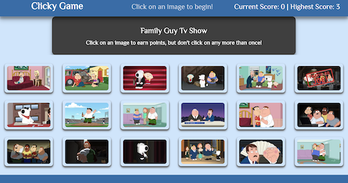

# Memory-game-with-React

 

Memory game build using React JS library. Components state is managed to respond to user events.

<ol>
<li>The application renders different images to the screen. Each image listens for click events.</li>
<li>The application keeps track of the user's score. The user's score is incremented on clicking an image for the first time. The user's score resets to 0 if they click the same image more than once.</li>
<li>Every time an image is clicked, the images rendered to the page shuffle themselves in a random order.</li>
<li>Once the user's score is reset after an incorrect guess, the game restarts.</li>
</ol>

<h6>Game is deployed to heroku. Here is the link <a href = "https://nameless-bayou-97416.herokuapp.com/" target="_blank">clicky-game</a></h6>

<h6>This project was bootstrapped with <a href = "https://github.com/facebook/create-react-app" target = "_blank">Create React App</>a.</h6>
